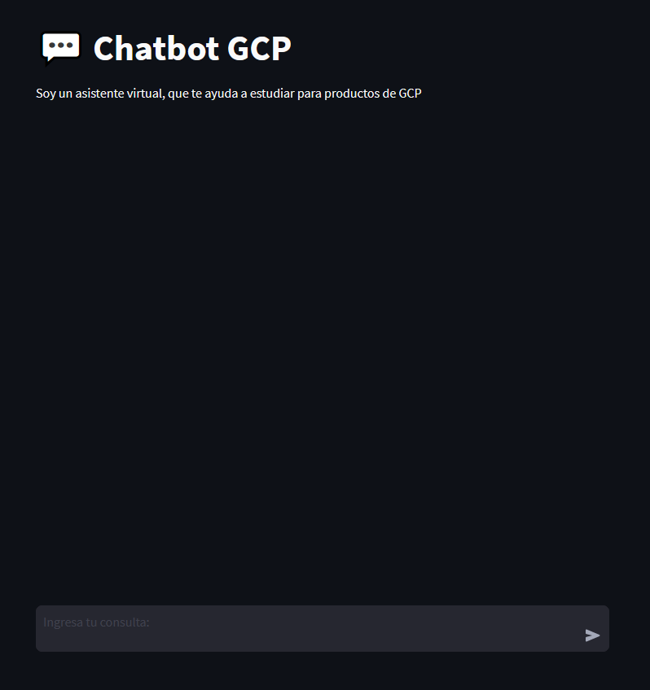
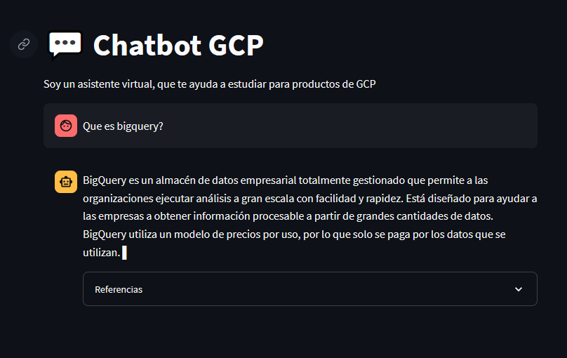
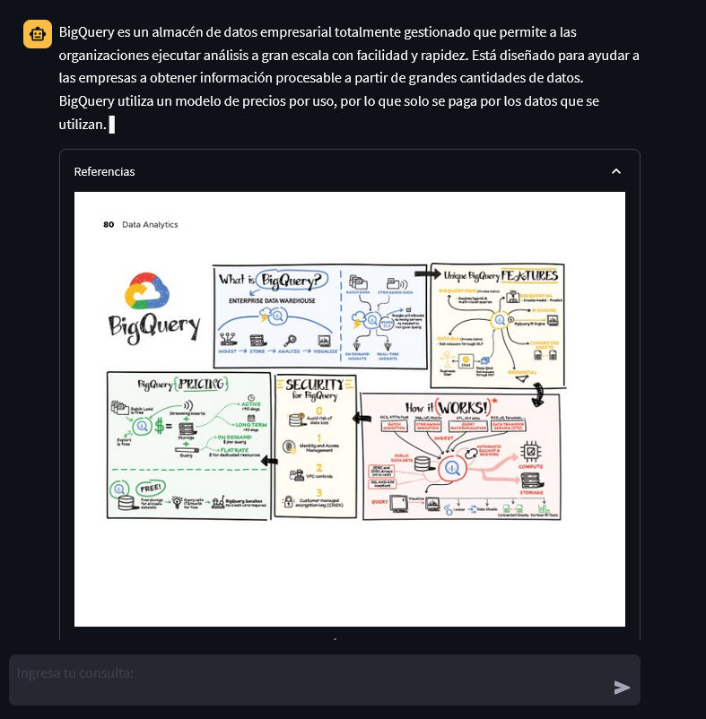
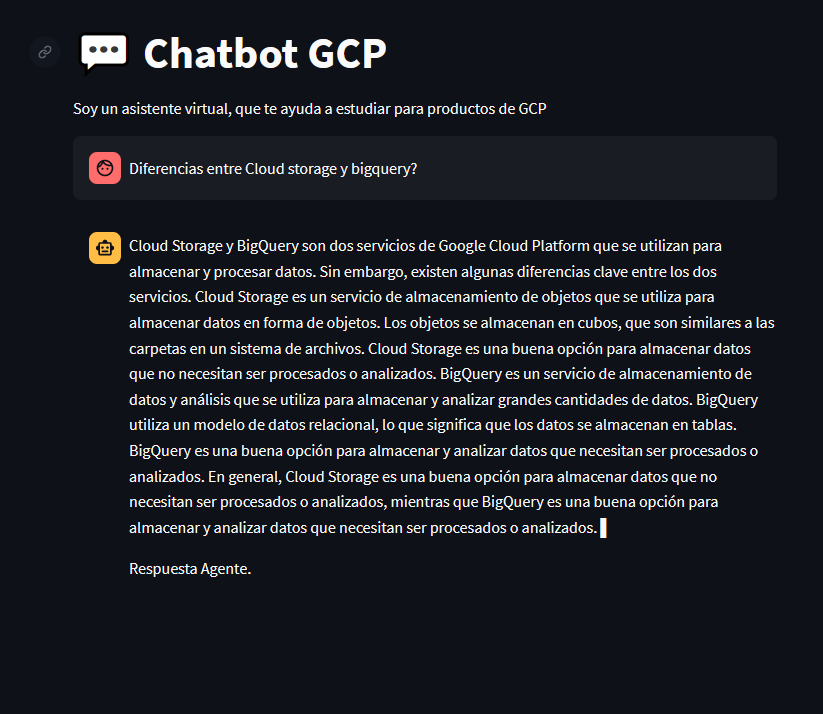

# AsistenteVirtualGCP

## Descripción

El asistente virtual tiene como propósito poder ayudar al usuario a estudiar y reformar conocimientos sobre diversos servicios/productos de <b>Google Cloud Platform</b>. Se pueden hacer preguntas específicas, como ¿Qué es BigQuery y cuáles son sus casos de uso? y preguntas de comparación tales como; ¿En que se diferencian Cloud SQL con Cloud Spanner?¿Cuáles son las principales diferencias entre Cloud Logging y Cloud Monitoring? Entre otras. 

<b>NOTA:</b>Se recomienda no utilizar el asistente virtual para preguntas de tipo examen.

## Capturas

* Interfaz inicial del asistente:

* Interfaz con respuestas del LLM:

* Interfaz de las referencias del LLM:

* Interfaz con respuesta del agente de Langchain

## Características Clave

Características del asistente:

* <b>Fuentes de información:</b> Utiliza dos fuentes de información; Un archivo pdf que contiene apuntes sobre la mayoría de los productos/servicios de Google Cloud Platform, este archivo tiene como última actualización el año 2022. La segunda fuente de información es un agente de búsqueda de información en Internet (Buscador Google) con la API SerapApi. Está última se invoca cuando el LLM no recibe ningun contenido del archivo pdf que pueda interpretar.

* <b>Tecnologías:</b> Se utilizaron principalmente dos APIs; El LLM de Vertex AI y SerapAPI.

* <b>Limitaciones:</b> El asistente no responde de forma correcta, preguntas con mucho contexto, caracteres, preguntas de tipo examen, preguntas sobre situaciones.

## Tecnologías Utilizadas

Las librerías utilizadas son:

* Vertex AI
* Streamlit
* LangChain
* Pandas
* Numpy
* PyPDF
* Googletrans
* Langdetect
* Os
* PyMuPDF
* Entorno virtual Virtualenv

## Instalación

Se debe crear un entorno virtual con virtualenv:

Instalación:

Creación del entorno virtual llamado .env:

Activación del entorno virtual:

Se deben instalar todas las librerías necesarias con <code> pip install -r requirements.txt </code> con el entorno activado.

## Uso

Se inicia el asistente virtual con <code>streamlit run App_docs.py</code>

## Estado del proyecto

Este asistente es una fase inicial, se tiene contemplado en el futuro mejorar la interfaz, y así otorgar una mejor experiencia al usuario. Además se planea desplegarlo en App Engine para todo público.